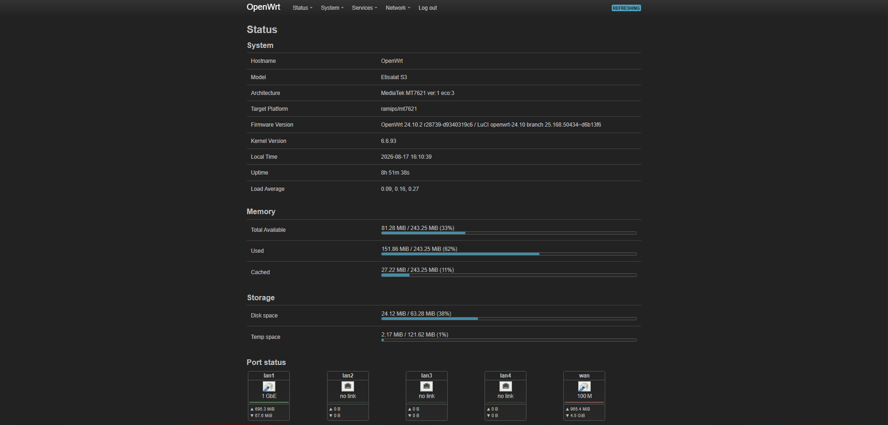
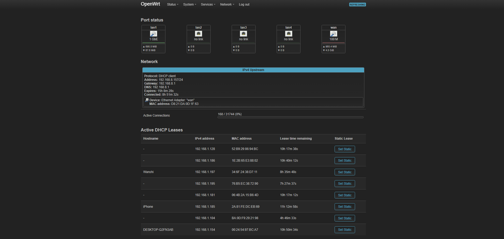
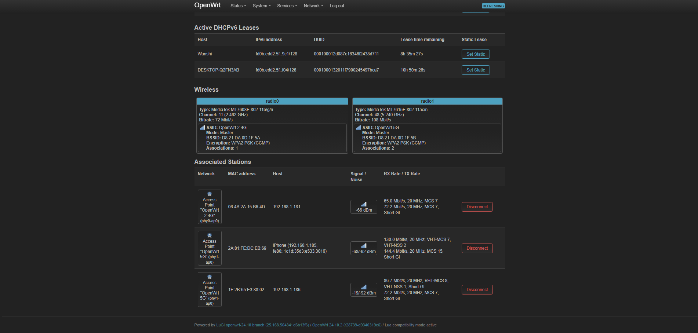
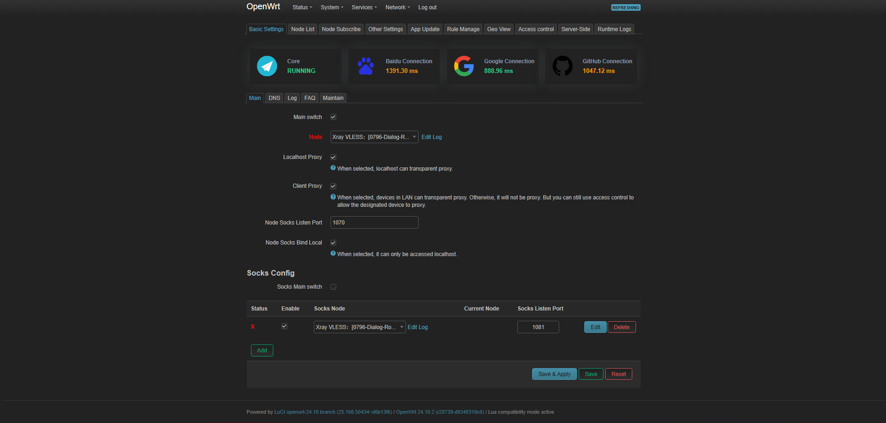
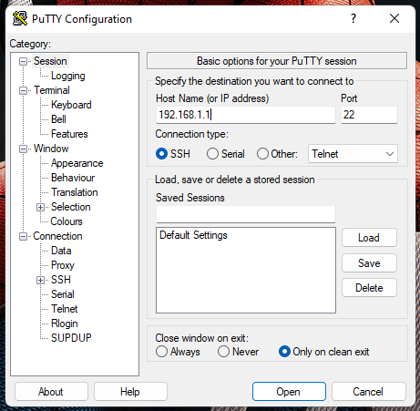
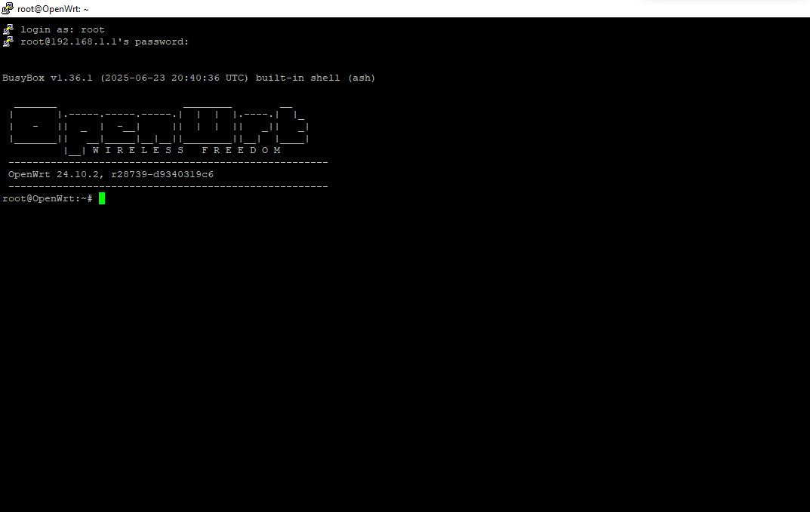

# Sercomm S3 → OpenWrt

<p align="center">
  
</p>

<p align="center">
  <b>A community-maintained, SSH-first conversion guide for the Sercomm S3 / Etisalat S3 router.</b><br>
  Stock firmware → SSH access → OpenWrt → LuCI → optional PassWall 2
</p>

<p align="center">


</p>

> [!WARNING]
> **Read this entire document before flashing anything.**
>
> Firmware flashing is a low-level operation. A wrong image, wrong partition, interrupted write, or incorrect boot-slot operation can make the router temporarily or permanently unbootable. **Verify the exact hardware model, image filename, partition layout, and backup files before executing destructive commands.**

---

## ✨ What this repository does

This repository documents an **SSH-first OpenWrt installation workflow** for the **Sercomm S3 / Etisalat S3** based on the MT7621 platform.

The workflow is intentionally split into independent stages:

```text
┌─────────────────────┐
│ Stock Sercomm S3    │
│ / Etisalat S3       │
└──────────┬──────────┘
           │
           ▼
┌─────────────────────┐
│ 01 · Configuration  │
│ Enable SuperUser /  │
│ SSH access          │
└──────────┬──────────┘
           │
           ▼
┌─────────────────────┐
│ 02 · Boot / Flash   │
│ Prepare slot and    │
│ write OpenWrt       │
└──────────┬──────────┘
           │
           ▼
┌─────────────────────┐
│ OpenWrt             │
│ SSH + root access   │
└──────────┬──────────┘
           │
           ├──────────────► Optional: LuCI
           │
           └──────────────► Optional: PassWall 2
```

### Repository goals

- Keep the procedure **repeatable**.
- Keep the critical commands visible and easy to audit.
- Separate **factory conversion** from **future sysupgrade**.
- Preserve screenshots and practical observations.
- Document the recovery path and common failure modes.
- Make the project understandable to someone performing the conversion for the first time.

---

## 📌 Hardware / software scope

| Item | Value |
|---|---|
| Router | **Sercomm S3 / Etisalat S3** |
| SoC | MediaTek MT7621 |
| OpenWrt target | `ramips/mt7621` |
| Stock gateway | `192.168.1.1` |
| Stock SSH user | `SuperUser` |
| OpenWrt SSH user | `root` |
| First-time image | `*-factory.img` |
| OpenWrt-to-OpenWrt image | `*-sysupgrade.bin` |
| Primary workflow | Ethernet + SSH/SCP |
| Optional web UI | LuCI |

> [!IMPORTANT]
> OpenWrt filenames, package versions, partition layouts, and repository locations can change between releases. **Do not blindly reuse a filename or version number from an old example.** Use the current image intended for the exact Sercomm S3 device and verify it before flashing.

---

# 🧭 Table of Contents

- [1. Before You Start](#1--before-you-start)
- [2. Repository Layout](#2--repository-layout)
- [3. Stage 01 — Enable SSH](#3--stage-01--enable-ssh)
- [4. Stage 02 — Install OpenWrt](#4--stage-02--install-openwrt)
- [5. Factory vs Sysupgrade](#5--factory-vs-sysupgrade)
- [6. Initial OpenWrt Setup](#6--initial-openwrt-setup)
- [7. Optional — LuCI](#7--optional--luci)
- [8. Optional — PassWall 2](#8--optional--passwall-2)
- [9. Verification Checklist](#9--verification-checklist)
- [10. Troubleshooting & Recovery](#10--troubleshooting--recovery)
- [11. Screenshots](#11--screenshots)
- [12. File / Command Reference](#12--file--command-reference)
- [13. Credits & External Resources](#13--credits--external-resources)
- [14. Disclaimer](#14--disclaimer)

---

# 1 · Before You Start

## 🧰 Required equipment

- Sercomm S3 / Etisalat S3 router.
- PC or laptop.
- Ethernet cable.
- Stable power supply for the router.
- SSH client:
  - Windows: PowerShell / Windows Terminal / PuTTY.
  - Linux/macOS: built-in terminal.
- SCP client:
  - Windows OpenSSH / WinSCP.
  - Linux/macOS `scp`.
- Python 3.x for configuration unpacking/packing.
- Correct OpenWrt firmware for the router.

### Recommended

Keep the PC connected by **Ethernet**, not Wi-Fi, throughout the flashing process.

Avoid:

- power interruption,
- unstable Ethernet adapters,
- VPNs that interfere with local routing,
- switching networks during SCP/SSH transfers,
- closing a terminal while a flash operation is running.

---

## 💾 Back up first

Before changing anything:

1. Log in to the stock router.
2. Export the original configuration.
3. Keep the untouched configuration in a safe location.
4. Record the router serial number.
5. Record the original firmware version.
6. Download the required OpenWrt images before starting.

A useful local backup structure is:

```text
backup/
├── original/
│   ├── configurationBackup.cfg
│   └── router-info.txt
└── firmware/
    ├── factory.img
    └── sysupgrade.bin
```

> [!CAUTION]
> Never overwrite your only copy of the original configuration.

---

# 2 · Repository Layout

```text
Sercomm-S3-OpenWrt/
│
├── README.md
│
├── Screenshots/
│   ├── 01.png
│   ├── 02.png
│   ├── 03.png
│   ├── 04.png
│   ├── 05.png
│   └── 06.png
│
├── docs/
│   ├── 01-config/
│   │   └── original-notes.txt
│   │
│   ├── 02-openwrt/
│   │   └── original-notes.txt
│   │
│   ├── 03-passwall2/
│   │   └── original-notes.txt
│   │
│   └── software-notes.txt
│
└── LICENSE
```

The numbered directories deliberately match the order of the physical installation process.

---

# 3 · Stage 01 — Enable SSH

## 🎯 Objective

The stock firmware does not necessarily expose the SSH access required for the later OpenWrt installation.

The documented workflow modifies the router configuration so that the `SuperUser` account can be used through SSH.

---

## 3.1 Export the stock configuration

From the stock router interface:

```text
Settings
   ↓
Configuration
   ↓
Save to Computer
```

Save the configuration backup locally.

If the router asks you to create or enter a backup password, **remember that password**. You may need it when importing the modified configuration.

---

## 3.2 Install Python

Install a current Python 3 release on the PC.

Verify:

```bash
python --version
```

or:

```bash
python3 --version
```

---

## 3.3 Obtain the configuration tool

This project uses the Sercomm configuration unpacker/packer:

**r3d5ky/sercomm_cfg_unpacker**

Repository:

https://github.com/r3d5ky/sercomm_cfg_unpacker

Place the tool and your configuration backup in the same working directory:

```text
config-work/
├── cfgtool.py
└── configurationBackup.cfg
```

---

## 3.4 Decode the configuration

Run:

```bash
python cfgtool.py -u configurationBackup.cfg
```

Depending on the tool/version, the resulting XML should be similar to:

```text
configurationBackup.xml
```

---

## 3.5 Add the SSH-enable parameter

Open:

```text
configurationBackup.xml
```

Find the router password parameter, similar to:

```xml
<PARAMETER name="Password"
           type="string"
           value="<router-serial>"
           writable="1"
           encryption="1"
           password="1"/>
```

Immediately after it, add:

```xml
<PARAMETER name="Enable"
           type="boolean"
           value="1"
           writable="1"
           encryption="0"/>
```

Save the XML.

> [!NOTE]
> The exact XML surrounding this parameter can vary. Do not remove unrelated configuration entries.

---

## 3.6 Repack the configuration

Move the original `.cfg` out of the working directory so the tool does not accidentally use the wrong input.

Then run:

```bash
python cfgtool.py -p configurationBackup.xml
```

A new configuration file should be generated.

Rename it to:

```text
configurationBackup.cfg
```

---

## 3.7 Import the modified configuration

Upload the modified configuration through the stock router interface.

If the router asks for the configuration backup password, use the password associated with the exported backup.

After the router accepts the configuration:

1. Wait for the router to finish processing.
2. Allow it to reboot if requested.
3. Reconnect by Ethernet.
4. Confirm the router is reachable at:

```text
192.168.1.1
```

---

## 3.8 SSH into the stock firmware

From a terminal:

```bash
ssh SuperUser@192.168.1.1
```

The documented credential format uses:

```text
Username: SuperUser
Password: router serial number
```

Use the serial number printed on your own router rather than copying an example password from this README.

Successful login should give you access to the stock firmware shell.

---

# 4 · Stage 02 — Install OpenWrt

> [!DANGER]
> **This is the destructive stage.**
>
> The commands below write directly to flash storage. Verify the device and partition mapping before writing an image.

---

## 4.1 Download the correct OpenWrt image

Use the official OpenWrt Firmware Selector:

https://firmware-selector.openwrt.org/

Search for:

```text
Sercomm S3
```

Select the exact supported device entry.

Download the appropriate:

```text
*-factory.img
```

and keep a copy of:

```text
*-sysupgrade.bin
```

for future upgrades.

---

## 4.2 Understand the two image types

### Factory image

```text
*-squashfs-factory.img
```

Use this when converting:

```text
Stock firmware → OpenWrt
```

### Sysupgrade image

```text
*-squashfs-sysupgrade.bin
```

Use this when the router is already running OpenWrt:

```text
OpenWrt → newer OpenWrt
```

### Decision tree

```text
                 What is currently installed?
                           │
              ┌────────────┴────────────┐
              │                         │
        Stock firmware              OpenWrt
              │                         │
              ▼                         ▼
        FACTORY IMAGE             SYSUPGRADE IMAGE
          *.img                       *.bin
```

> [!CAUTION]
> **Do not substitute a sysupgrade image for the first factory conversion unless the device-specific OpenWrt documentation explicitly says to do so.**

---

# 5 · Boot-Slot Preparation

The documented Sercomm S3 workflow uses the router's dual-boot arrangement.

## 5.1 Enter the stock SSH shell

```bash
ssh SuperUser@192.168.1.1
```

Then:

```sh
sh
```

---

## 5.2 Switch the active boot flag

The original procedure uses:

```sh
printf 1 | dd bs=1 seek=7 count=1 of=/dev/mtdblock3
```

Then reboot:

```sh
reboot
```

Allow the router time to boot before continuing.

> [!WARNING]
> This command directly modifies flash-related state. **Confirm that your exact S3 hardware/revision matches the documented partition layout before running it.**

---

# 6 · Transfer the Factory Image

From your **PC**, in the directory containing the factory image:

```bash
scp openwrt-*-ramips-mt7621-etisalat_s3-squashfs-factory.img \
SuperUser@192.168.1.1:/tmp/
```

Confirm that the transfer completed successfully.

---

# 7 · Verify the Flash Layout

SSH back into the router:

```bash
ssh SuperUser@192.168.1.1
```

Then:

```sh
sh
```

Inspect the MTD table:

```sh
cat /proc/mtd
```

Look for the partition identified by the device-specific OpenWrt instructions as the target for the factory image.

The historical procedure in this repository refers to:

```text
mtd4
```

Do **not** assume `mtd4` is correct on every hardware revision without checking.

---

# 8 · Flash OpenWrt

If the verified partition is `mtd4`, the documented command is:

```sh
cd /tmp

mtd -r write openwrt-*-ramips-mt7621-etisalat_s3-squashfs-factory.img mtd4
```

The router should write the image and reboot.

### During this operation

**DO NOT:**

- unplug the router,
- close the connection intentionally,
- reset the router,
- modify the Ethernet connection,
- start another flash operation.

Allow several minutes for the router to reboot and initialize.

---

# 9 · Initial OpenWrt Setup

After the router has booted into OpenWrt:

```bash
ssh root@192.168.1.1
```

The initial OpenWrt image may allow root SSH access without a password.

Immediately set a root password:

```sh
passwd
```

Follow the prompts.

---

# 10 · Optional — LuCI

If you want the OpenWrt web administration interface and the router has working Internet access:

```sh
opkg update
```

Then:

```sh
opkg install luci
```

After installation, restart the web service if necessary:

```sh
/etc/init.d/uhttpd restart
```

Open:

```text
http://192.168.1.1/
```

> [!NOTE]
> Package manager commands depend on the OpenWrt release and repository configuration. Recent OpenWrt releases may use different package-management tooling than older releases. Follow the package instructions for the exact release installed on the router.

---

# 11 · Optional — PassWall 2

PassWall 2 is an **optional** component and is not required for a normal OpenWrt installation.

The original project files contain a package-based installation workflow for OpenWrt 24.x.

Because PassWall 2 packages and Xray builds change frequently, treat the included package versions as **historical examples**, not permanent dependencies.

## 11.1 Required components

The original procedure references:

- PassWall 2 LuCI package.
- PassWall package dependencies.
- Xray core.
- `chinadns-ng`.
- `tcping`.
- `geoview`.

The original notes are preserved here:

```text
docs/03-passwall2/original-notes.txt
```

---

## 11.2 Important storage constraint

The Sercomm S3 has limited storage.

Do not blindly install every package from a large package archive.

Before installing:

```sh
df -h
```

Check available space.

A safer workflow is:

```text
Download
   ↓
Identify only required packages
   ↓
Copy packages to /tmp
   ↓
Check free space
   ↓
Install
   ↓
Verify service
   ↓
Remove unnecessary files
```

---

# 12 · Verification Checklist

After OpenWrt boots, verify the installation systematically.

## System identity

```sh
cat /etc/openwrt_release
```

and:

```sh
uname -a
```

Confirm the expected target:

```text
ramips/mt7621
```

---

## Network

```sh
ip addr
```

Check:

- `br-lan`
- LAN address
- WAN state

Test the gateway:

```sh
ping -c 4 192.168.1.1
```

Test external connectivity:

```sh
ping -c 4 1.1.1.1
```

Test DNS:

```sh
ping -c 4 downloads.openwrt.org
```

If the IP ping works but DNS fails, investigate DNS configuration rather than assuming the WAN connection is completely broken.

---

## Storage

```sh
df -h
```

Pay particular attention to:

```text
/overlay
/tmp
```

---

## Processes / services

```sh
ps
```

For LuCI:

```sh
/etc/init.d/uhttpd status
```

For PassWall 2, if installed:

```sh
/etc/init.d/passwall2 status
```

---

# 13 · Troubleshooting & Recovery

## Router does not respond at `192.168.1.1`

First check the Ethernet connection.

Temporarily configure the PC with:

```text
IP:      192.168.1.2
Mask:    255.255.255.0
Gateway: 192.168.1.1
```

Then test:

```bash
ping 192.168.1.1
```

If there is still no response, inspect link status and consider the device's recovery mechanism.

---

## `scp` fails

Verify:

```bash
ping 192.168.1.1
```

Then test SSH:

```bash
ssh SuperUser@192.168.1.1
```

If SSH works but SCP does not, check:

- image filename,
- path,
- permissions,
- available `/tmp` space,
- SSH server behavior.

---

## OpenWrt boots but there is no Internet

Check:

```sh
ip addr
```

```sh
ip route
```

```sh
cat /etc/resolv.conf
```

Then test separately:

```sh
ping -c 4 1.1.1.1
```

and:

```sh
ping -c 4 downloads.openwrt.org
```

This distinguishes:

```text
Layer 3 connectivity problem
        vs
DNS resolution problem
```

---

## Package installation fails

Check:

```sh
df -h
```

Then:

```sh
opkg update
```

If the package manager cannot reach repositories, investigate:

1. WAN interface.
2. Default route.
3. DNS.
4. Repository configuration.
5. OpenWrt release compatibility.
6. Architecture compatibility.

Do not randomly install packages from another OpenWrt release.

---

## Router fails to boot OpenWrt

The original notes describe a dual-boot fallback mechanism.

Before attempting recovery, disconnect unnecessary equipment and document the router's current state.

If the documented recovery procedure for your exact hardware/revision uses repeated power cycles to trigger the alternate boot path, follow the verified device-specific instructions rather than experimenting with arbitrary flash commands.

---

# 14 · Screenshots

The screenshots below are stored directly in the repository so GitHub renders them without external hosting.

## Configuration / SSH stage

### Screenshot 01


### Screenshot 02



---

## OpenWrt installation

### Screenshot 03



### Screenshot 04



---

## Post-install / configuration

### Screenshot 05



### Screenshot 06



> [!TIP]
> GitHub automatically renders relative image paths such as `Screenshots/01.png`. Keeping screenshots inside the repository is therefore preferable to linking to temporary image-hosting sites.

---

# 15 · Command Reference

## Stock firmware

```bash
ssh SuperUser@192.168.1.1
```

## Decode configuration

```bash
python cfgtool.py -u configurationBackup.cfg
```

## Encode configuration

```bash
python cfgtool.py -p configurationBackup.xml
```

## Copy factory image

```bash
scp openwrt-*-factory.img SuperUser@192.168.1.1:/tmp/
```

## Inspect flash partitions

```sh
cat /proc/mtd
```

## OpenWrt SSH

```bash
ssh root@192.168.1.1
```

## Set password

```sh
passwd
```

## System information

```sh
cat /etc/openwrt_release
uname -a
```

## Network diagnostics

```sh
ip addr
ip route
cat /etc/resolv.conf
```

## Storage diagnostics

```sh
df -h
```

---

# 16 · External Resources

### OpenWrt

Official OpenWrt website:

https://openwrt.org/

Official Firmware Selector:

https://firmware-selector.openwrt.org/

### Sercomm configuration tool

`r3d5ky/sercomm_cfg_unpacker`:

https://github.com/r3d5ky/sercomm_cfg_unpacker

### Xray

The original project notes reference the `jameszeroX/Xray-core-UPX` release repository:

https://github.com/jameszeroX/Xray-core-UPX/releases

### PassWall 2

The original project notes reference:

https://github.com/Openwrt-Passwall/openwrt-passwall2/releases

> [!NOTE]
> External projects are maintained by their respective authors. Version numbers, package names, URLs, and compatibility can change independently of this repository.

---

# 17 · Recommended Git Workflow

After creating the repository:

```bash
git init
git add .
git commit -m "docs: add Sercomm S3 OpenWrt installation guide"
git branch -M main
git remote add origin https://github.com/<YOUR-USERNAME>/Sercomm-S3-OpenWrt.git
git push -u origin main
```

A useful commit structure is:

```text
docs: add initial installation guide
docs: add SSH configuration procedure
docs: add OpenWrt flashing procedure
docs: add recovery notes
docs: add PassWall 2 notes
docs: update screenshots
```

---

# 18 · Suggested Future Improvements

This repository can be expanded with:

- [ ] Exact hardware revision identification.
- [ ] Verified `/proc/mtd` output.
- [ ] Verified boot-slot behavior.
- [ ] Stock firmware version history.
- [ ] OpenWrt release compatibility matrix.
- [ ] Automated configuration backup tool.
- [ ] Automated firmware checksum verification.
- [ ] Factory-reset procedure.
- [ ] UART recovery documentation.
- [ ] Serial-console pinout.
- [ ] Network topology diagram.
- [ ] Annotated PCB photographs.
- [ ] Known-good firmware checksums.
- [ ] Known-good package checksums.
- [ ] Tested recovery procedure.
- [ ] Changelog for every verified OpenWrt release.

---

# 19 · Disclaimer

This repository is provided for **educational and research purposes**.

You are responsible for:

- verifying your exact hardware,
- obtaining the correct firmware,
- backing up your configuration,
- verifying commands before execution,
- maintaining stable power during flashing,
- understanding the risks of modifying router firmware.

Neither this repository nor its contributors guarantee that the procedure will work on every hardware revision, firmware revision, regional variant, or future OpenWrt release.

**If a command writes directly to `/dev/mtd*`, stop and verify the target before executing it.**

---

## ⭐ If this helped

If you successfully converted a Sercomm S3 to OpenWrt using this documentation:

- Star the repository.
- Report the exact router/firmware revision.
- Document successful and unsuccessful steps.
- Submit improvements with reproducible evidence.
- Keep backups of known-good firmware and configuration files.

---

<p align="center">
  <b>Sercomm S3 → OpenWrt</b><br>
  SSH-first • Reproducible • Documented • Community maintained
</p>
